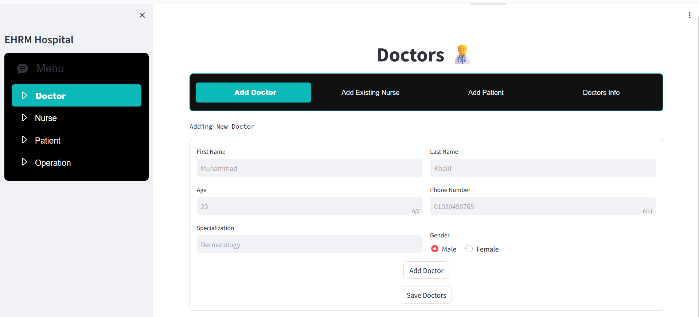
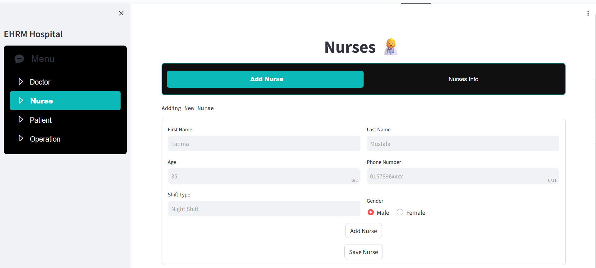
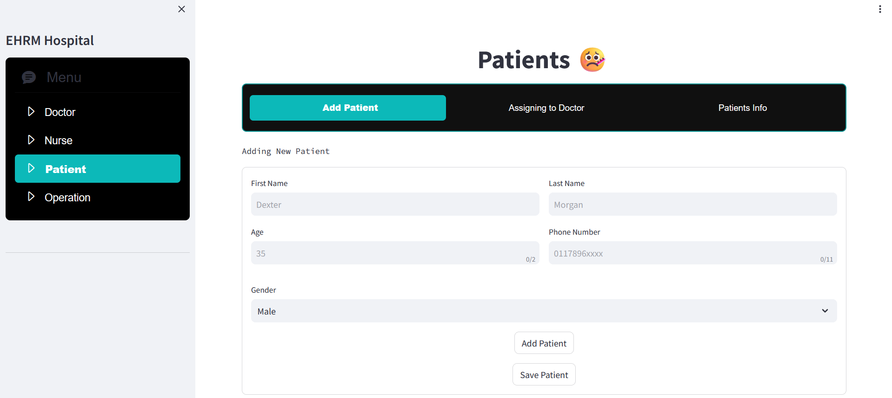
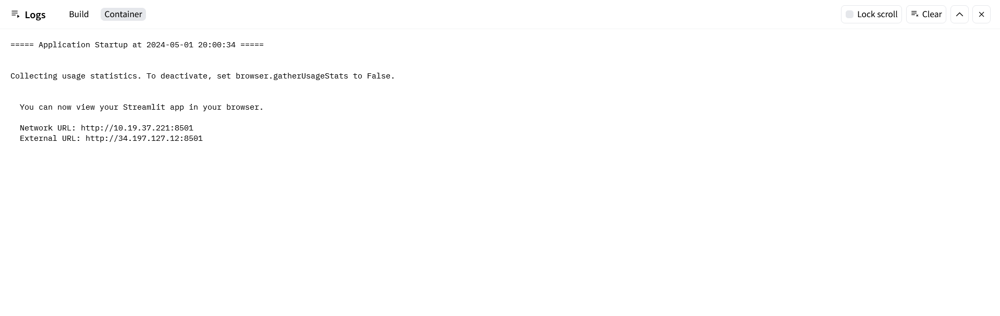

🥤Check out the configuration reference at https://huggingface.co/docs/hub/spaces-config-reference

🥤Check out for the Hugging Face Repository : https://huggingface.co/spaces/prithivMLmods/Medical-Hospital-System/tree/main

🥤Check out for the Huggingface StreamLit App: https://huggingface.co/spaces/prithivMLmods/Medical-Hospital-System/tree/main

## Doctor Record Insertion🧑‍⚕️

## Nurse Record Insertion 👩‍⚕️

## Patient Record Insertion 😷

## Packages & Dependencies

Run Command 🚀 : pip install -r requirements.txt

## Run StreamLit Web App

Run Command 🚀 : streamlit run app.py

## That's it you can see the app running on the network / external url as like above..🔗

